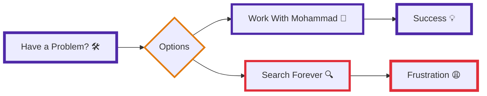

# 👨‍💻 Mohammad Ahmad — Precision in Engineering, Creativity in Design, and Intelligent High-Performance Solutions

_"Simplicity is the soul of efficiency.✨⚙️"_ – Austin Freeman  
_"First, solve the problem. Then, write the code.🧠🛠️"_ – John Johnson

---

---

## 🚀 **About Me**

I'm a **Full-Stack Engineer** and **Software Architect** focused on turning complex requirements into elegant, production-ready systems. Specializing in Next.js, Node.js, and AI integrations (RAG), I bridge the gap between high-performance backend logic and intuitive UI/UX design.

From architecting multi-tenant platforms to securing **8th place at Teknofest 2025** for health-tech innovation, I deliver secure, scalable software that balances engineering precision with user-centric design.

💡 What I focus on:

- **AI Integration**: Building RAG systems, FastAPI microservices, and LLM-based assistants
- **Web Architecture**: Next.js, Node.js, TypeScript, PostgreSQL, AWS, Google Cloud
- **Mobile Development**: Flutter + Firebase for Android & iOS
- **System Design**: Multi-tenant architecture, scalable systems, SOLID principles, CI/CD
- **UI/UX Excellence**: Designing interfaces that blend beauty with functionality

---

## 🏆 **Featured Case Studies**

From AI-powered legal tech to healthcare innovation, here are some of my highlight projects:

### ⚖️ [SnowLex — AI Legal Research Platform](https://snowlex.fi)

A legally reliable AI research platform combining large-scale vector search with a purpose-built legal dashboard for real-world legal workflows.

| Tech Stack                                                                   | Highlights                                                                                          |
| ---------------------------------------------------------------------------- | --------------------------------------------------------------------------------------------------- |
| Next.js, TypeScript, Python, FastAPI, Qdrant, Ollama, Firebase, Google Cloud | RAG pipeline with 2M+ legal vectors • 90% reduction in research time • Zero-hallucination citations |

---

### 🏥 Medflo — Intelligent Healthcare Ecosystem

A modern healthcare platform that replaces outdated systems with intuitive design, scalable architecture, and patient-centered digital experiences.

| Tech Stack                                                  | Highlights                                                                                     |
| ----------------------------------------------------------- | ---------------------------------------------------------------------------------------------- |
| Figma, Next.js, TypeScript, Firebase, Node.js, Flutter, AWS | Unified internal, patient & marketing systems • WCAG-compliant UI • Scalable foundation for AI |

---

### 🩺 RMTS — Rheumatoid Arthritis Monitoring System | 🏆 Teknofest 2025 (8th/13,000+)

A fully integrated wearable glove system for continuous RA monitoring, combining custom hardware, mobile app, doctor dashboard, and AI-assisted reporting.

| Tech Stack                                                     | Highlights                                                                             |
| -------------------------------------------------------------- | -------------------------------------------------------------------------------------- |
| Flutter, Next.js, ESP32, BLE, Biomedical Sensors, AI Reporting | 8th place at Teknofest • Smart glove with vibration relief • Real-time health tracking |

---

### 🌱 Plant AI — Smart Plant Care Companion

AI-powered plant identification and care companion app that helps users identify plants, assess their health, and manage personal gardens.

| Tech Stack                                               | Highlights                                                               |
| -------------------------------------------------------- | ------------------------------------------------------------------------ |
| Flutter, Dart, Firebase, Plant.id API, MVVM Architecture | 1000+ plant species • 50+ disease types • Cross-platform (iOS & Android) |

---

### ✈️ BILET — Multi-Tenant Tourism & Booking Platform

A multi-tenant tourism platform designed to automate trip planning, booking, pricing, and communication between travelers and agencies.

| Tech Stack                                            | Highlights                                                           |
| ----------------------------------------------------- | -------------------------------------------------------------------- |
| Next.js, TypeScript, Node.js, PostgreSQL, Prisma, AWS | Multi-tenant architecture • Dynamic pricing • Automated booking flow |

---

### 📍 LocaLink — Location-Based Social Media App

A mobile social media application built around real-world location, events, and community interaction.

| Tech Stack                                           | Highlights                                                         |
| ---------------------------------------------------- | ------------------------------------------------------------------ |
| Flutter, Firebase, Mapbox, Geofencing, Google Vision | Interactive map feed • Event creation & booking • Geofencing logic |

---

## 🛠️ **Tech Toolbox**

### **Languages**

| Language       | Proficiency | Language   | Proficiency |
| -------------- | ----------- | ---------- | ----------- |
| TypeScript     | 💪 Expert   | JavaScript | 💪 Expert   |
| Dart (Flutter) | 💪 Strong   | Python     | 💪 Strong   |
| C#             | 💪 Strong   | SQL        | 💪 Strong   |

### **Technologies & Frameworks**

| Category           | Tools                                                       |
| ------------------ | ----------------------------------------------------------- |
| **Frontend**       | React, Next.js, TypeScript, HTML/CSS                        |
| **Mobile**         | Flutter, Dart, Firebase                                     |
| **Backend**        | Node.js, Express.js, FastAPI, Python                        |
| **AI/ML**          | RAG pipelines, Qdrant, Ollama, LangChain, BGE-M3 Embeddings |
| **Databases**      | PostgreSQL, Firebase/Firestore, Prisma                      |
| **Cloud & DevOps** | Google Cloud Run, AWS, Firebase, GitHub Actions, CI/CD      |
| **Design**         | Figma, Adobe Creative Suite                                 |

---

## 🌍 **Professional Experience**

### 🧠 **JUSTICE4.0** — Software & AI Developer _(Aug 2025 – Present)_

_Helsinki, Finland (Remote)_

- Engineering the complete **RAG pipeline** for SnowLex: ingesting legal PDFs, embedding with BGE-M3, and serving via FastAPI
- Designed **hybrid Qdrant search** over 2M+ self-embedded Finnish & EU legal vectors
- Integrated **Llama 3 Poro 2 8B LLM** for legally grounded answers with source-backed citations

### 🧩 **Tigflo** — Software Architect | UI/UX Designer _(Dec 2024 – Present)_

_Sharjah, UAE (Remote)_

- Built and maintained **500+ reusable, multi-theme UI components** across Next.js and Flutter
- Delivered **140+ responsive dashboard screens** supporting light/dark modes
- Led code reviews and established best practices for scalable healthcare platforms

### 🧳 **Ticket Travel & Tourism** — Full-Stack Developer _(Apr 2025 – Oct 2025)_

_Muscat, Oman (Remote)_

- Built full-scale **self-service tourism platform** (booking, CRM, ERP) using Next.js, Node.js, Prisma
- Architected **multi-tenant AWS infrastructure** for white-labeled deployments

### 🏢 **Zoom Property** — Full-Stack Developer _(Aug 2023 – Nov 2023)_

_Istanbul, Turkey_

- Developed **CRM system** managing bookings, transportation, and customer lifecycle
- Integrated real-time updates and automated driver reminders

### � **Reason8** — UI/UX Designer (Freelance) _(Apr 2024 – May 2024)_

- Designed responsive **15-page UI/UX** with 75 components across two themes

---

## 🧭 **Leadership & Initiatives**

- 🎓 **Founder, Codyle Academy** — Training next-gen developers through Flutter & React bootcamps
- 💼 **Codyle Student Club (President)** — Organized tech events and hackathons at Üsküdar University
- 🏆 **Teknofest 2025 Finalist** — RMTS ranked **8th out of 13,000+ projects** nationally

---

## 📊 **GitHub Stats**

- 🔥 **2,000+** GitHub Contributions
- 📁 **12+** Production Projects
- 🗓️ **2+ Years** Professional Experience

---

## 🎯 **Let's Build Something Awesome**

📧 [mnsoqar1@gmail.com](mailto:mnsoqar1@gmail.com)  
🌐 [LinkedIn](https://www.linkedin.com/in/mohammad-soqar-ahmad/)  
🐙 [GitHub](https://github.com/Mohammad-soqar)  
💼 [Portfolio](https://mohammad-soqar.github.io/Portfolio-/)

---

